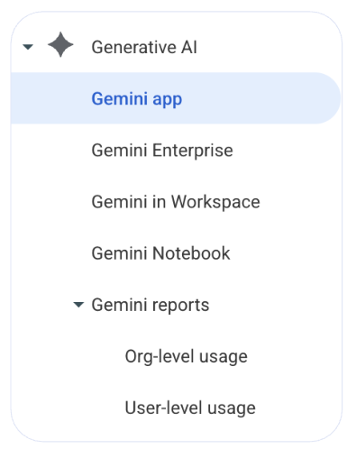
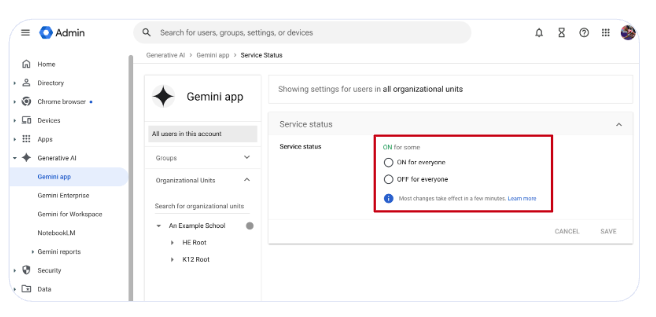

# Gemini Admin Console Configuration & Deployment

## The Gemini App

### Generative AI Navigation Menu

* Everyone should see **all** of these navigation items
* If you do not see "Gemini in Workspace" open a Google Support Ticket
* "Gemini Enterprise" is an additional paid add-on everyone will see

### Enabling the Gemini App Core Service

1. Navigate to the Google Admin Console
1. Navigate to **Generative AI** menu item and then click on **Gemini App**
1. Click **service status**
1. Select an OU or use an Access group

> [!NOTE]
> Configure by OU or Access Group

Step by Step guide: [Help Center article](https://knowledge.workspace.google.com/admin/generative-ai/gemini-app/turn-the-gemini-app-on-or-off)

### Configuring Gemini App Settings: Connected Apps

1. **Workspace apps:** Allows Gemini to interact with services like Docs and Calendar.
1. **Classroom app:** Allows the Gemini app to find information from Google Classroom and return responses in the Gemini app *(users 18+ only)*.
1. **Other apps:** Allows Gemini to interact with services like YouTube and Maps.

End users can enable/disable “Connected Apps” in their Gemini settings

### Configuring Gemini Conversation History

* If you choose for conversation history to be on, select how long conversations are stored before they’re automatically deleted: 3, 18, or 36 months. The default is ON and 18 months.
* Gemini chats use rolling deletion for retention. However, interacting with a chat thread keeps it alive. For example, if you have retention set to 3 months but interact with a Gemini chat thread on the 89th day, that chat thread will continue.
* Vault now supports separate Gemini retention for admins.

### Configuring Gemini Conversation Management

* Even if users delete chats, they are still retained by Vault based on your retention rules, just like Gmail.
* Temporary chats are retained in Vault but do not get saved to the end user’s history in the Gemini App.
* The default is ON for both options. Consider adjusting for students.

